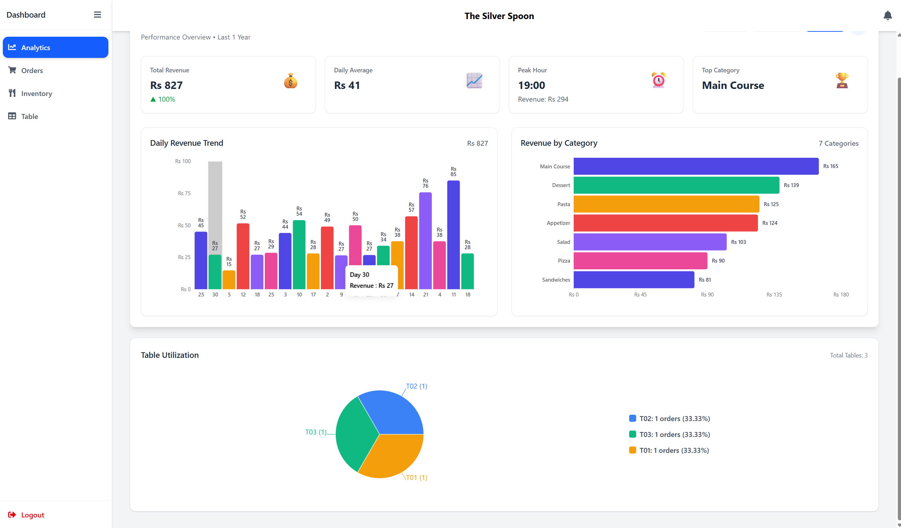
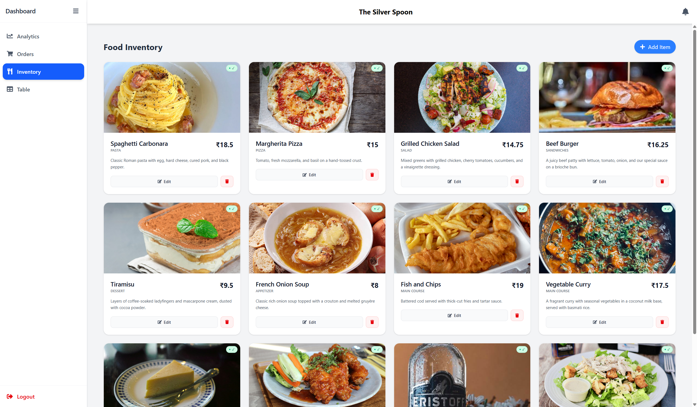
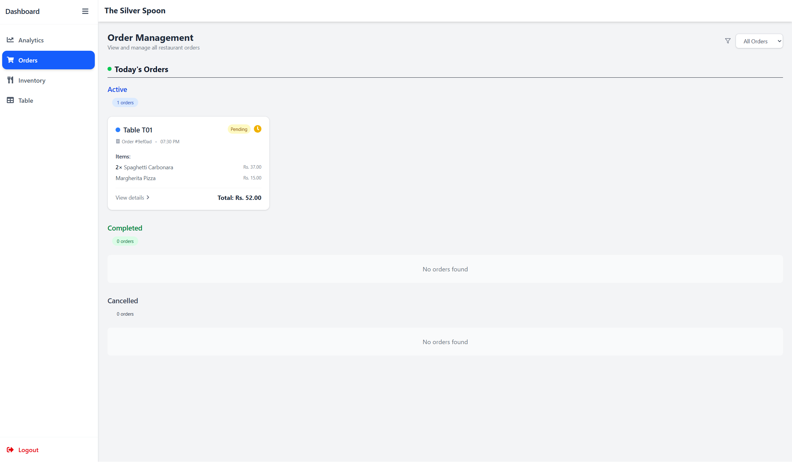
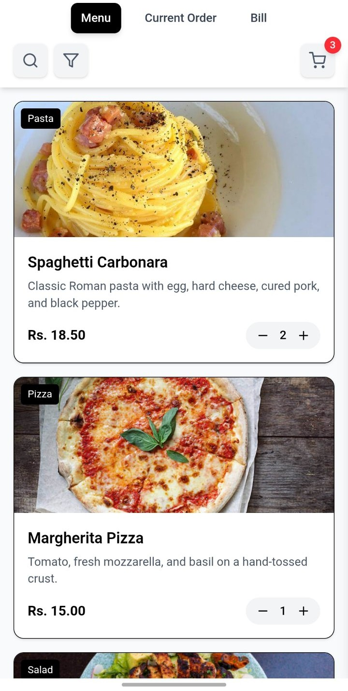
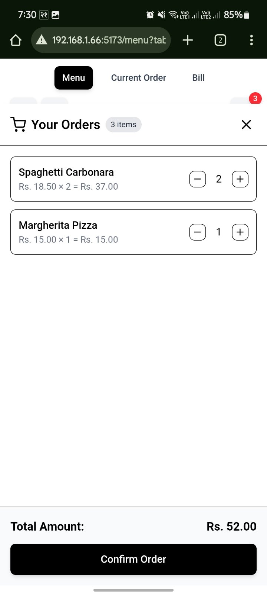
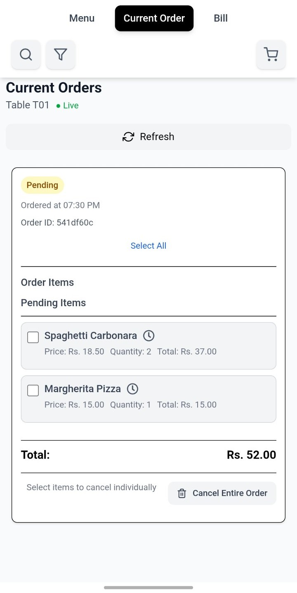
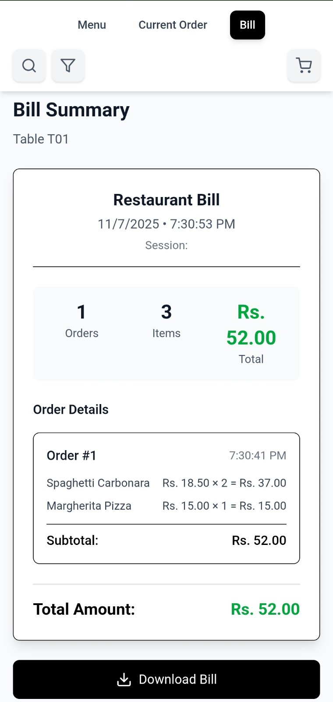

# 🍽️ ROMS – Restaurant Management System (MERN Stack)

---

## 💡 Project Overview  
ROMS is a full‑stack application built on the **MongoDB, Express.js, React, Node.js (MERN)** stack, designed to modernize the restaurant ordering experience. Guests can simply scan a QR code to view the menu on their phone, place orders seamlessly, and view their current order and bill — while staff manage inventory, orders, and dashboard metrics in the backend.

---

## ✨ Key Features  
- **QR Code Menu & Ordering**: Customers scan a table‑specific QR code, browse the digital menu, add items to their cart, and place orders from their device.  
- **Full‑stack Implementation**: Built with React for the frontend and Node/Express for backend APIs, with MongoDB handling data persistence.  
- **Admin Dashboard**: Staff and management have a dedicated UI to view inventory, track orders in real time, and monitor performance.  
- **Real‑Time Order Flow**: Orders placed by customers are captured instantly, processed by backend services, and updated on the dashboard.  
- **Responsive & Mobile‑First**: The system is optimized for mobile devices (for customer side) and desktop (for administrative side).

---

## 🖼️ Screenshots & UI Views  

### 🧑‍💼 Admin Dashboard  
  

### 📦 Inventory View  
  

### 📦 Orders View  
  

### 🍔 Customer Menu  
  

### 🛒 Customer Cart  
  

### 🧾 Current Order  
  

### 💳 Customer Bill  
  

---

## 🛠️ Tech Stack  
| Component         | Technology               |
|-------------------|--------------------------|
| Frontend          | React.js                 |
| Backend           | Node.js, Express.js      |
| Database          | MongoDB                  |
| API Communication | RESTful APIs             |
| Authentication    | JSON Web Tokens (JWT)    |
| Styling/UI        | CSS / Styled‑Components  |

---

